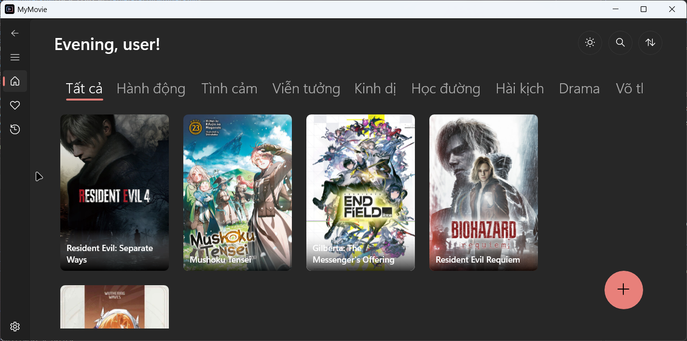
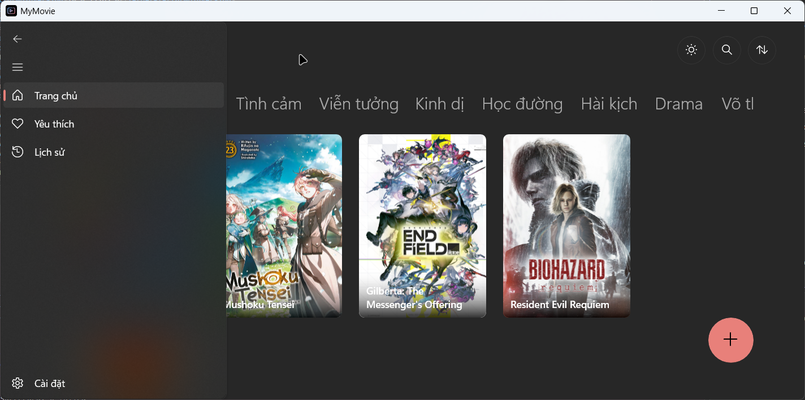
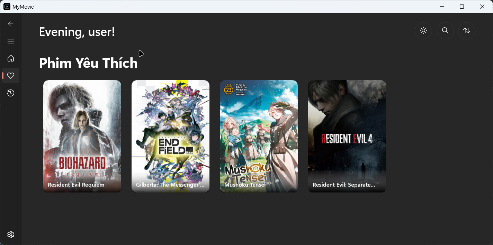
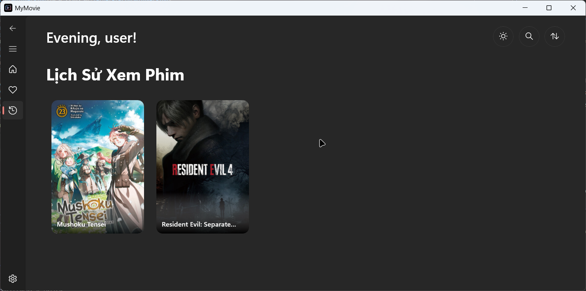
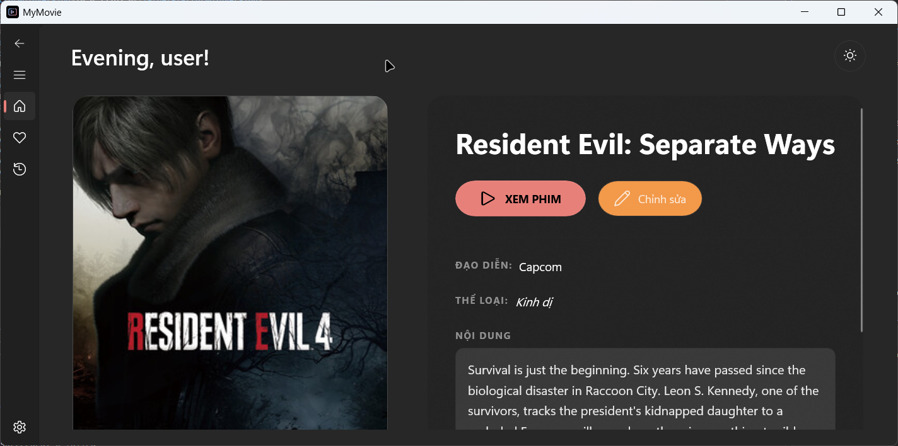
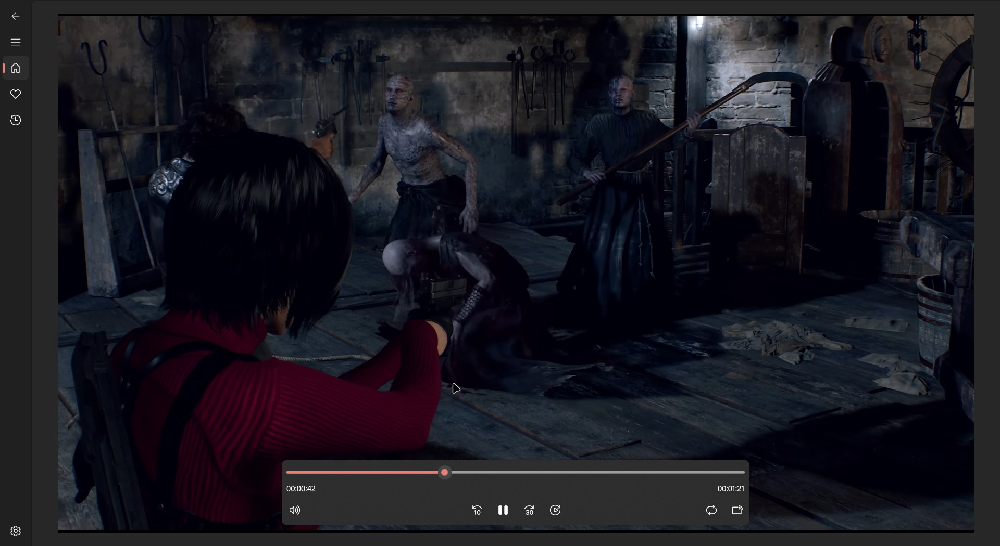

# MyMovie - Movie Watching Platform

Ứng dụng xem phim hiện đại xây dựng trên nền tảng **WinUI 3** và **.NET 10**.

## Tính năng nổi bật

  * **Giao diện hiện đại**: Sử dụng hiệu ứng Mica và Acrylic chuẩn Windows 11.
  * **Quản lý thông minh**: Danh sách phim yêu thích và lịch sử xem phim.
  * **Hiệu năng cao**: Tối ưu hóa cho kiến trúc x64.

## Hướng dẫn cài đặt

1.  Vào mục [Releases](https://github.com/NguyenHuann/MyMovie/releases/tag/v1.0.0-stable) và tải về file `.zip` mới nhất.
2.  Giải nén thư mục.
3.  Chuột phải vào file **`Install.ps1`** và chọn **Run with PowerShell**.
4.  Làm theo hướng dẫn trên màn hình để cài đặt chứng chỉ bảo mật và ứng dụng.

## Công nghệ sử dụng

  * **Ngôn ngữ**: C\#
  * **Framework**: WinUI 3 (Windows App SDK)
  * **Database**: Entity Framework Core & SQLite

## Hình ảnh ứng dụng

